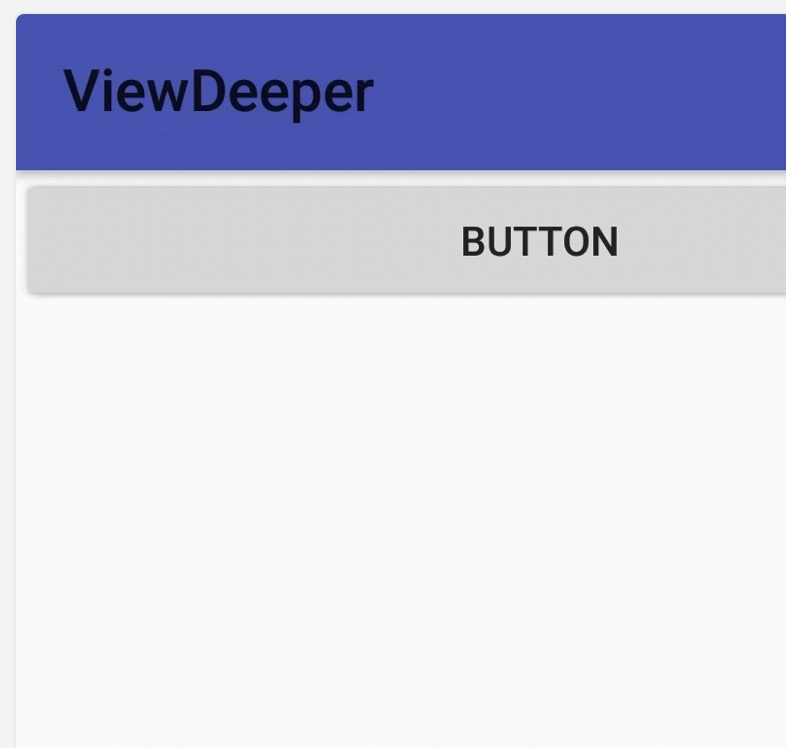

# T47

[TOC]

# 深入理解View

## 参考：

 Android视图绘制流程完全解析，带你一步步深入了解View


## part1

https://blog.csdn.net/guolin_blog/article/details/12921889



### 代码区

```
private LinearLayout mainLayout;

@Override
public void onCreate(@Nullable Bundle savedInstanceState) {
    super.onCreate(savedInstanceState);
    setContentView(R.layout.activity_main);
    mainLayout = (LinearLayout) findViewById(R.id.main_layout);
    LayoutInflater LayoutInflater = android.view.LayoutInflater.from(this);
    View buttonLayout = LayoutInflater.inflate(R.layout.button_layout, null);
    mainLayout.addView(buttonLayout);

}
```


## part 2 实现一个自己的ViewGroup

ref: https://blog.csdn.net/guolin_blog/article/details/16330267

### original pic


### eg1


```
childView.layout(-30, -30, childView.getMeasuredWidth()-90, childView.getMeasuredHeight());
```

对应：

可以看到左侧没有显示完


### eg 2


```
childView.layout(200, 100, childView.getMeasuredWidth()+ 90, childView.getMeasuredHeight() - 90);

```


对应：


可以看到右移了很多

#### side note

```
12-09 14:49:31.482 23230-23230/? E/tt1: onLayout: childView.getMeasuredWidth() 1080
12-09 14:49:31.482 23230-23230/? E/tt1: onLayout: childView.getMeasuredHeight() 1710
```

对于原图 500 x 500 左右的jpg ，到设备上的width 和 height 如上 ， 是1k 以上，为啥呢？todo 1209