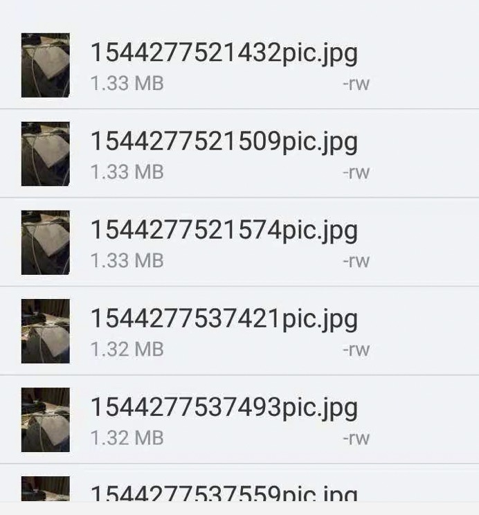

# T47

## stage 23 camera

1. WindowManager.LayoutParams有个参数(`WindowManager.LayoutParams.FLAG_FULLSCREEN`)，
可以让我们，通过`window.setFlags(int flag, int mask)`,来设置应用全屏显示

2. Camera2Fragment是需要v13里的`android.support.v13.app.FragmentCompat`的,但是我们改成`ActivityCompat`倒也运行成功

- [x]   (1007done at 1208) 分析，阅读这个camera代码

## stage 22 bottom sheet

## stage 21 call and sms

## stage 19 尝试一个viewpager实现

## stage 18 练习broadcastReceiver 很痛苦

不是productFlavor的问题，能够接受系统广播，能发送自己的自定义广播，不能接受自己的广播

后来听说是android 8的一些省电优化，为了克服上述接受不到自己的广播的问题，我们应该使用动
态，在代码里注册的方式。